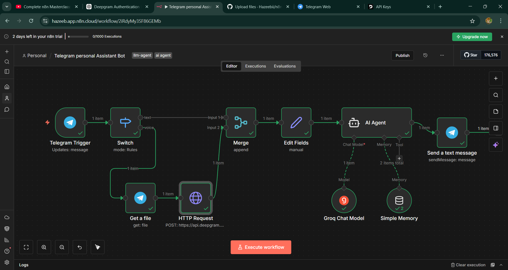

# 🤖 AI Telegram Personal Assistant (n8n)

An AI powered Telegram assistant that can understand text and voice messages, remember conversations, and respond intelligently using an LLM.

## Features

* Text chat assistant
* Voice message understanding (speech-to-text)
* Conversation memory
* AI generated responses
* Automation workflow

## Tech Stack

* n8n (workflow automation)
* Groq LLM (AI responses)
* Deepgram API (speech-to-text)
* Telegram Bot API
* Webhooks & HTTP Requests

## What it does

1. User sends message in Telegram
2. Workflow detects text or voice
3. Voice → converted to text
4. Sent to AI agent
5. Memory stores conversation
6. AI replies back in Telegram

## Author

Hazeeb A

---

## 📸 Screenshots

### n8n Workflow

### Telegram Bot Reply + Voice Understanding

